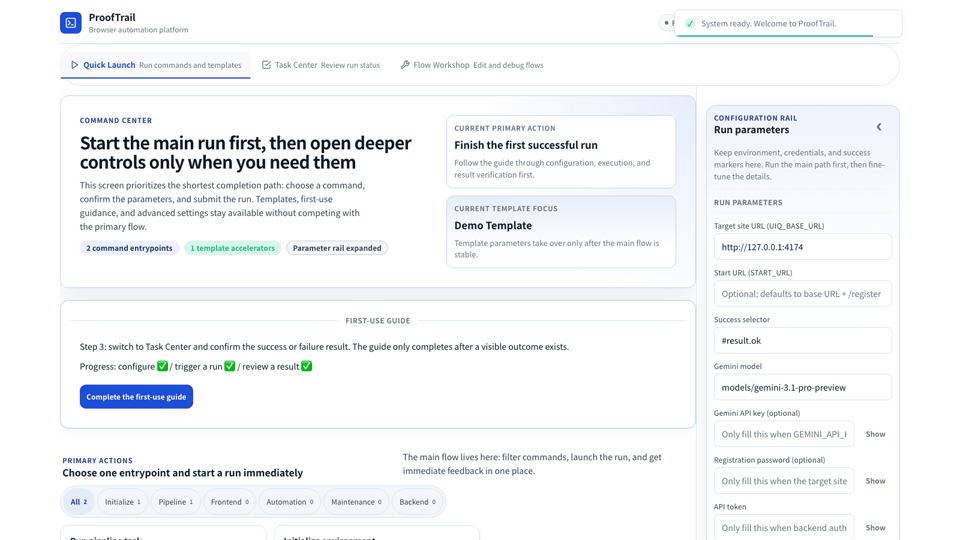

# ProofTrail

Evidence-first browser automation with recovery and MCP.

For AI agents and human operators who need inspectable runs, retained evidence,
and guided recovery.

> ProofTrail is the browser-evidence and recovery layer, not a generic browser
> bot and not a hosted agent shell.

Current public distribution and ecosystem boundaries:
[DISTRIBUTION.md](DISTRIBUTION.md) | [INTEGRATIONS.md](INTEGRATIONS.md)

## 30-Second Version

If you only want the shortest truthful product line, use this:

- run one canonical browser workflow
- keep one retained evidence bundle
- recover before guesswork
- expose the same governed surface through API and MCP

That is why this repo fits Codex, Claude Code, OpenHands, OpenCode, OpenClaw,
and similar agent shells that need a browser-evidence layer instead of another
prompt-only browser bot.

Start here first:

1. [Canonical evaluation path](docs/getting-started/human-first-10-min.md)
2. [What good retained evidence looks like](docs/reference/run-evidence-example.md)
3. [Public docs hub](docs/index.md)

If this is still your first truthful pass, stop there.
AI-agent fit, coding-agent fit, API builder entry, MCP package truth, and
distribution pages all stay **second ring** until the canonical run already
makes sense.
When you are ready for that layer, continue through [docs/index.md](docs/index.md)
instead of treating those pages as co-equal first doors.
If the next question is specifically about package/install truth, open the
[MCP Distribution Contract](docs/reference/mcp-distribution-contract.md) after
that first run.

## Current primary lane vs later lanes

If you only need the truthful packet order, keep it this simple:

- **Primary product lane**
  - canonical run -> retained evidence -> recovery/review
  - this is the stable repo identity and the default public story
- **Current MCP lane that works now**
  - local checkout + stdio through `pnpm mcp:start`
  - `apps/mcp-server/` is the governed MCP side road for that local lane, not a
    new top-level product identity
- **Current public skill/discovery lanes**
  - the ClawHub skill page is live as a public discovery page for the
    repo-owned ProofTrail MCP skill packet
  - the repo-owned skill packet under `skills/proofyard-mcp/` is materialized
    here, but no generic cross-host skill-registry publication is evidenced yet
  - Goose `#26`, agent-skill.co `#182`, and awesome-opencode `#275` are now
    separate upstream review lanes, not live listings
  - the OpenHands/extensions submission is now a closed historical receipt,
    not a live listing or active review lane
- **Later / contract-only lanes**
  - npm package publication
  - MCP Docker image publication
  - Official MCP Registry listing
  - vendor-specific plugin or official integration claims

Those later lanes can be documented now, but they must stay documented as
**later / contract-only / not yet live** until a fresh upstream read-back
exists.



The static storefront hero source still lives at
`assets/storefront/proofyard-readme-hero.svg`.

The storefront command-center screenshot artifact lives at
`assets/storefront/proofyard-hero.png`.

> ProofTrail is for AI agents and human operators who need browser automation
> to stay inspectable, replayable, and recoverable after the first run.

## Category Fit

ProofTrail is an evidence-first browser automation product:

- run one canonical workflow
- inspect one retained evidence bundle
- recover with structured guidance
- expose the same trusted surfaces to MCP clients and optional AI helpers

## Canonical Evaluation Path

If this is your first truthful pass through the repo, keep the order strict:

1. run `just setup`
2. run `just run`
3. inspect the retained bundle under `.runtime-cache/artifacts/runs/<runId>/`
4. confirm the visible result in **Task Center**
5. use **Recovery Center** before diving into raw logs, replay, or builder side
   roads

That is the default product lane for Wave 2:

- first run first
- retained evidence second
- recovery/review before guesswork
- ecosystem, builder, and MCP pages only after the first proof path is clear

## Why ProofTrail

- **One canonical path**: start with `just run`, then inspect one retained
  evidence bundle instead of juggling ad-hoc scripts and shell fragments.
- **Recovery before guesswork**: move from explanation to recovery to compare
  before you fall back to raw logs or helper-path debugging.
- **AI and MCP in the right place**: use AI reconstruction and MCP as governed
  side roads after the first proof run, not as replacements for the
  deterministic mainline.
- **Strong AI-builder fit without fake heat**: ProofTrail is a truthful browser
  evidence layer for Codex, Claude Code, OpenHands, OpenCode, OpenClaw, and
  other AI-agent workflows that need retained proof, recovery, and governed
  integration instead of prompt-only browser improvisation.

Desktop host-automation note:

- desktop smoke / e2e / business / soak are now operator-manual lanes
- they require `UIQ_DESKTOP_AUTOMATION_MODE=operator-manual` plus
  `UIQ_DESKTOP_AUTOMATION_REASON=<auditable reason>`

## Builder Entry

If you are integrating ProofTrail into another toolchain, use this order:

1. [API Builder Quickstart](docs/how-to/api-builder-quickstart.md)
2. [Universal API Reference](docs/reference/universal-api.md)
3. `node --import tsx contracts/scripts/generate-client.ts --verify`
4. [ProofTrail MCP Server README](apps/mcp-server/README.md)

That sequence helps you separate:

- the **API contract layer**
- the **generated-client freshness path**
- the **governed MCP tool surface**

The checked-in client under `apps/web/src/api-gen/` is a **repo-local
generated helper**, not a published SDK package.

## MCP Install Surfaces

Use these four layers to avoid mixing a working local install with public
discovery pages or unpublished package contracts.

- **Current / usable now**
  - local checkout + stdio through `pnpm mcp:start`
  - optional `UIQ_MCP_API_BASE_URL` / `UIQ_MCP_AUTOMATION_TOKEN` when you want
    the MCP process to call a live backend
- **Live public skill page**
  - the ClawHub ProofTrail MCP page is live as a discovery surface for the
    skill packet
  - that page does **not** turn ProofTrail into a hosted endpoint, official
    plugin, or generic skill-registry publication
- **Repo-owned skill packet and review lanes**
  - `skills/proofyard-mcp/` is the repo-owned install skill packet
  - Goose `#26`, agent-skill.co `#182`, and awesome-opencode `#275` are the
    current active upstream review lanes
  - OpenHands/extensions is closed-not-accepted and no longer an active review
    lane
  - no generic cross-host skill-registry listing is evidenced yet
- **Contract-only later lanes**
  - npm package: `@proofyard/mcp-server`
  - Docker image: `ghcr.io/xiaojiou176-open/proofyard-mcp-server:0.1.1`
  - Official MCP Registry stays blocked until the npm package is actually
    published

Those future-facing names are part of the public contract now, but they are
**not** live install paths until the package/image is actually published.

If you are evaluating this repo for **Codex**, **Claude Code**,
**OpenHands**, **OpenCode**, **OpenClaw**, or similar coding-agent workflows,
keep the fit narrow and honest:

- ProofTrail does **not** replace a coding agent
- it fits as the browser execution, retained evidence, recovery, and governed
  MCP/API layer that a coding agent can call
- the best public entry is still
  [ProofTrail for AI Agents](docs/how-to/proofyard-for-ai-agents.md), then the
  builder/API and MCP pages

## For Coding-Agent And Agent-Stack Workflows

If you found ProofTrail while searching for:

- browser automation for Codex
- browser automation for Claude Code
- browser automation for OpenHands
- browser automation for OpenCode
- browser automation for OpenClaw
- MCP browser automation for AI agents
- API-first browser evidence for tool-using agents

read this repo in one very specific way:

> ProofTrail is a browser-execution and evidence layer for agent shells such as
> Codex, Claude Code, OpenHands, OpenCode, OpenClaw, and other tool-using AI
> workflows. It is **not** claiming to be an official vendor-specific
> integration, plugin, or generic AI assistant shell.

The most truthful ecosystem fit today looks like this:

| Ecosystem | Best public angle | Best first road |
| --- | --- | --- |
| Claude Code | governed browser-evidence side road for a tool-using coding shell | [ProofTrail for Coding Agents and Agent Ecosystems](docs/how-to/proofyard-for-coding-agents.md) -> [MCP for Browser Automation](docs/how-to/mcp-quickstart-1pager.md) |
| Codex | browser-evidence substrate with API-first control and optional MCP | [ProofTrail for Coding Agents and Agent Ecosystems](docs/how-to/proofyard-for-coding-agents.md) -> [API Builder Quickstart](docs/how-to/api-builder-quickstart.md) |
| OpenHands | browser-evidence subsystem behind a larger orchestration runtime | [ProofTrail for AI Agents](docs/how-to/proofyard-for-ai-agents.md) -> [API Builder Quickstart](docs/how-to/api-builder-quickstart.md) |
| OpenCode | governed MCP browser surface behind the coding-agent shell | [ProofTrail for Coding Agents and Agent Ecosystems](docs/how-to/proofyard-for-coding-agents.md) -> [MCP for Browser Automation](docs/how-to/mcp-quickstart-1pager.md) |
| OpenClaw | browser workflow backend behind a multi-channel gateway or tool router | [ProofTrail for Coding Agents and Agent Ecosystems](docs/how-to/proofyard-for-coding-agents.md) -> [API Builder Quickstart](docs/how-to/api-builder-quickstart.md) |

The truthful bridge is:

1. [ProofTrail for AI Agents](docs/how-to/proofyard-for-ai-agents.md)
2. [ProofTrail for Coding Agents and Agent Ecosystems](docs/how-to/proofyard-for-coding-agents.md)
3. [MCP for Browser Automation](docs/how-to/mcp-quickstart-1pager.md)
4. [API Builder Quickstart](docs/how-to/api-builder-quickstart.md)

This discovery layer is **not claiming** official vendor integrations, plugins,
or a generic AI assistant shell.

That order keeps search intent and product truth aligned:

- audience fit first
- coding-agent fit second
- governed MCP tool use third
- direct API control after that

## Ecosystem Fit At A Glance

If you only have ten seconds, use the map below like an airport departures
board:

- **Claude Code** and **OpenCode** are the clearest MCP-first fits today
- **Codex**, **OpenHands**, and **OpenClaw** usually start API-first or hybrid
- **ProofTrail** stays the browser-evidence and recovery layer in all cases

The ecosystem-fit visual source lives at
`assets/storefront/proofyard-agent-ecosystem-map.svg`.

## Explore the Second Ring

Once the canonical evaluation path already makes sense, use these pages as the
current second ring for ecosystem fit, governed side roads, and deeper proof:

1. [ProofTrail for AI Agents](docs/how-to/proofyard-for-ai-agents.md)
2. [ProofTrail for Coding Agents and Agent Ecosystems](docs/how-to/proofyard-for-coding-agents.md)
3. [MCP for Browser Automation](docs/how-to/mcp-quickstart-1pager.md)
4. [AI Reconstruction Side Road](docs/how-to/ai-reconstruction-side-road.md)
5. [ProofTrail vs Generic Browser Agents](docs/compare/proofyard-vs-generic-browser-agents.md)
6. [Evidence, Recovery, and Review Workspace](docs/how-to/evidence-recovery-review-workspace.md)

If your search intent sounds more like:

- `browser automation for Codex`
- `browser automation for Claude Code`
- `browser automation for OpenHands`
- `browser automation for OpenCode`
- `browser automation for OpenClaw`
- `MCP browser automation for AI agents`
- `browser evidence layer for coding agents`

start with [ProofTrail for AI Agents](docs/how-to/proofyard-for-ai-agents.md)
only after the first-run lane is already clear.

That sequence keeps the outward story honest:

- audience fit first
- coding-agent fit second
- governed MCP and AI side roads next
- alternatives framing after that
- evidence/recovery/review loop as the deepest current product proof

Use the builder entry separately from the first-run lane.

The second ring explains category fit and product shape.
The builder entry explains contract-level integration once that product shape
already makes sense.

If you are coming from the builder side instead of the operator side, pair that
matrix with the [API Builder Quickstart](docs/how-to/api-builder-quickstart.md)
so the public story and the integration story stay connected.

## First Practical Win

Choose the shortest path that matches what you want to confirm first:

- If you want to produce one canonical run:
  Start with `just setup && just run`.
  You should get a new run directory under
  `.runtime-cache/artifacts/runs/<runId>/` with manifest and proof reports.
- If you want to know what good evidence should look like:
  Start with [docs/reference/run-evidence-example.md](docs/reference/run-evidence-example.md).
  That page shows the concrete report shape a healthy run should produce.
- If you want to follow the guided operator path:
  Start with [docs/getting-started/human-first-10-min.md](docs/getting-started/human-first-10-min.md).
  That is the shortest human-readable route from fresh checkout to inspectable
  proof.

## 15-Minute Evaluation Path

If you are seeing ProofTrail for the first time, keep the first pass simple:

1. run `just setup`
2. run `just run`
3. inspect the resulting bundle under `.runtime-cache/artifacts/runs/<runId>/`
4. use the command center for the deeper follow-up:
   - `Quick Launch` to repeat the canonical path
   - `Task Center` to confirm the result and inspect retained evidence
   - `Recovery Center` inside `Task Center` before raw logs or replay
   - `Flow Workshop` only after you already have one clear result

Treat helper and workshop commands like the advanced bench. Keep them available,
but do not use them as the default first step.

The evaluator path for a first pass is intentionally short:

1. run the canonical flow
2. confirm the visible result in Task Center
3. inspect the retained evidence bundle
4. use Recovery Center before raw logs or shell fallbacks
5. only then open sharing, compare, or deeper workshop tools

If you are evaluating through the local command center instead of only the CLI,
use the same story in product form:

1. **Quick Launch**: start the canonical run first
2. **Task Center**: confirm the result and inspect the evidence state first
3. **Recovery Center**: use the recovery layer inside Task Center before raw logs
   or workshop replay
4. **Flow Workshop**: refine drafts or replay steps only after the first result
   already exists

## What This Repo Actually Does

How do we make browser automation reproducible, inspectable, and recoverable?

ProofTrail gives you one public mainline for running a workflow, one evidence
bundle for understanding what happened, and one shared repo for the backend,
web command center, automation runner, and MCP adapter that support that flow.

Think of the product in two layers:

- **Primary layer**: canonical run, evidence, recovery
- **Secondary layer**: template reuse, compare, studio tuning, AI
  reconstruction, MCP integration

The canonical public mainline is:

1. run `just setup`
2. run `just run`
3. inspect `.runtime-cache/artifacts/runs/<runId>/`

`just run` is the canonical public mainline wrapper for
`pnpm uiq run --profile pr --target web.local`.

`just run-legacy` remains available for lower-level workshop troubleshooting,
but it is not the canonical public mainline.

## Why Teams Use It

- **Fewer mystery failures**: every canonical run writes a manifest-anchored
  evidence bundle with summary, index, and proof reports instead of leaving
  you with scattered logs and screenshots.
- **Easier recovery**: the web command center, run records, and flow workshop
  are built to help you inspect, replay, and repair workflows after something
  breaks.
- **One repo, one story**: backend orchestration, operator UI, automation
  runner, and release proof surfaces live together, so docs and runtime truth
  can stay aligned.

## Quickstart

Requirements:

- Python 3.11+
- Node.js 20+
- `pnpm`
- `uv`
- `just`

1. Install dependencies and local tooling.

```bash
just setup
```

1. Run the canonical workflow.

```bash
just run
```

1. Inspect the resulting evidence bundle.

```bash
ls .runtime-cache/artifacts/runs
```

What good looks like:

- a new run directory appears under `.runtime-cache/artifacts/runs/<runId>/`
- the run contains `manifest.json`, `reports/summary.json`,
  `reports/diagnostics.index.json`, `reports/log-index.json`,
  `reports/proof.coverage.json`, `reports/proof.stability.json`,
  `reports/proof.gaps.json`, and `reports/proof.repro.json`
- `manifest.json` points back to those proof artifacts through both
  `manifest.proof` and `manifest.reports`
- the same orchestrator-first chain is reachable through
  `pnpm uiq run --profile pr --target web.local`
- even when the PR gate fails, `reports/summary.json` still tells you why
  instead of leaving you with a silent shell failure

If `just run` fails, start with the
[human-first 10 minute guide](docs/getting-started/human-first-10-min.md) and
the [run evidence example](docs/reference/run-evidence-example.md) before
dropping to legacy helper paths.

If `just run` succeeds, the next stop is Task Center: confirm the result, read
the evidence summary, and only then move into explain/share/recovery paths.

If you are already in the Web command center, keep the same order:

1. start from **Quick Launch**
2. move to **Task Center** to confirm the result and inspect evidence
3. use **Recovery Center** before diving into raw logs
4. open **Flow Workshop** only when you intentionally need the advanced draft
   or replay surfaces

## After The First Successful Run

Once one canonical or operator-supported result already exists, the next value
layer is no longer "how do I start?" It becomes "how do I reuse, compare,
operate, and hand this off without losing trust?"

Use the product surfaces in this order:

1. **Template reuse / readiness** in **Flow Workshop**
   - Ask: "Is this flow stable enough to reuse, or should it stay in workshop mode?"
   - Treat readiness as a reuse verdict, not as a vanity score.
2. **Compare** in **Task Center**
   - Ask: "How does this retained run differ from a baseline run?"
   - Use compare to judge change, not to replace the canonical evidence bundle.
3. **Profile / Target Studio**
   - Ask: "Which knobs are safe to tune, and what validation runs when I save?"
   - Studio is a guarded operator surface, not a raw YAML editor.
4. **AI reconstruction**
   - Ask: "Do I need help rebuilding a flow from artifacts?"
   - Use it only after artifacts already exist; it is an optional advanced helper.
5. **MCP**
   - Ask: "Do I need an external AI client to inspect runs or operate this
     repo safely?"
   - Treat it as an integration side road, not as a replacement for `just run`.
6. **Review Workspace**
   - Ask: "Do I need one review-ready packet before I hand this run to another maintainer?"
   - Treat it as a local-first review packet, not as a hosted collaboration product.
7. **Template Exchange**
   - Ask: "Do I need to move a reusable template contract into another checkout?"
   - Use import/export/share for that handoff, not a marketplace mental model.

Wave 5 also makes the recovery boundary more explicit:

- `inspect_task`-style actions are safe to suggest immediately
- replay actions stay human-confirmed
- OTP, provider-step, and manual-input actions stay manual-only

## Outward Product Story

Use this mental model when you explain ProofTrail to a new evaluator:

- **What it is**: evidence-first browser automation with recovery and MCP
- **Who it helps**: AI agents and human operators who need trustworthy browser workflows
- **Why it feels different**: the product does not stop at
  “the automation ran”; it keeps the evidence, recovery path, and handoff
  surfaces attached to the run
- **Where AI fits**: AI reconstruction helps after artifacts already exist
- **Where MCP fits**: MCP exposes the same governed surfaces to external AI clients

## Suitable / Not Suitable

Suitable for:

- teams standardizing browser automation runs across operators and environments
- maintainers who need inspectable evidence instead of ad-hoc shell output
- workflows where replay, diagnostics, and recovery matter as much as
  first-run success

Not suitable for:

- tiny one-off browser scripts where no shared evidence or recovery path is needed
- teams unwilling to maintain a Python + Node workspace
- people looking for a hosted SaaS with zero local setup

## Validation and Governance

ProofTrail keeps the public story honest by separating runtime proof from
governance checks.

- [Minimal success case](docs/showcase/minimal-success-case.md)
- [Run evidence example](docs/reference/run-evidence-example.md)
- [Quality gates](docs/quality-gates.md)
- [Changelog](CHANGELOG.md)
- [Release guide](docs/release/README.md)
- [Release supply-chain policy](docs/reference/release-supply-chain-policy.md)
- Maintainer GitHub closure evidence: `just github-closure-report`

Public collaboration contract:

- external pull requests stay on GitHub-hosted, low-risk governance and build
  lanes
- live, external, and owner-secret workflows are manual-only and require the
  protected `owner-approved-sensitive` environment
- macOS-only smoke and regression lanes use GitHub-hosted `macos-latest`;
  `self-hosted` / `shared-pool` are not part of the public collaboration
  contract

## Maintainer Space Hygiene

ProofTrail treats disk cleanup as a governed maintenance path, not an ad-hoc
"delete the biggest folder" exercise.

- `just space-report` emits a repo-exclusive JSON report for runtime buckets,
  `safe-clean` residue, explicit `reclaim` candidates, protected totals, and the
  dedicated external pnpm layer
- `just space-clean-safe` runs a default **dry-run** for the low-risk cleanup
  wave; use `./scripts/space-clean-safe.py --apply` only when you want to
  execute the same safe-clean list
- `just space-clean-reclaim` runs a default **dry-run** for large
  repo-exclusive reclaim targets such as the root `.venv`, isolated
  `node_modules`, and the repo-scoped pnpm store; use explicit `--scope ...`
  plus `--apply` only after the matching validation gate passes
- `just runtime-gc -- --dry-run` previews retention-based cleanup for the
  review-class runtime buckets before you let the same policy delete old files
- canonical run evidence under `.runtime-cache/artifacts/runs/`, runtime
  backups under `.runtime-cache/backups/`, and managed toolchains under
  `.runtime-cache/toolchains/` are intentionally outside the first cleanup wave
- empty run stub directories under `.runtime-cache/artifacts/runs/` are the
  one explicit exception: they may enter the first safe-clean wave only when
  they are still empty and have no evidence files yet
- the canonical Python runtime target is `.runtime-cache/toolchains/python/.venv`;
  the root `.venv` is a retired legacy surface and may only be reclaimed
  through `space-clean-reclaim --scope root-venv` after single-track validation

## FAQ

### Do I need the legacy helper path?

No. `just run` is the public default road. `just run-legacy` is only for
lower-level workshop troubleshooting when you need to inspect helper-path
behavior directly.

### Where should I look after a run finishes?

Start with `.runtime-cache/artifacts/runs/<runId>/manifest.json`, then open
`reports/summary.json`, the four `reports/proof.*.json` files, and the index
files described in
[docs/reference/run-evidence-example.md](docs/reference/run-evidence-example.md).

If you are using the local command center, the matching product path is:

1. open **Task Center**
2. inspect the evidence state first: `retained`, `partial`, `missing`, or `empty`
3. use **Failure Explainer** to understand the current run
4. use **Share Pack** when you want a handoff-friendly summary
5. use **Compare** when you need a baseline-versus-candidate judgment
6. treat **Promotion Candidate** as a later release/showcase decision, not as the
   first diagnostic step

### Is this repository already a full docs site?

Not yet. Today the GitHub README is the conversion page, and the docs surface is
the supporting second layer. See [docs/index.md](docs/index.md) for the current
public docs map.

## Repository Map

- `apps/api/` - backend API and orchestration services
- `apps/web/` - operator-facing web command center
- `apps/automation-runner/` - record, replay, and reconstruction pipeline
- `apps/mcp-server/` - MCP adapter
- `packages/` - shared orchestration and runtime packages
- `configs/` - environment, schema, and governance configuration
- `contracts/` - API contracts
- `scripts/` - repo entrypoints and CI helpers
- `docs/` - storefront-supporting public docs surface

## Documentation

- Docs map: [docs/index.md](docs/index.md)
- Public docs overview: [docs/README.md](docs/README.md)
- Architecture contract: [docs/architecture.md](docs/architecture.md)
- CLI guide: [docs/cli.md](docs/cli.md)
- [docs/localized/zh-CN/README.md](docs/localized/zh-CN/README.md)

## Security and Contribution

- [SECURITY.md](SECURITY.md)
- [SUPPORT.md](SUPPORT.md)
- [CONTRIBUTING.md](CONTRIBUTING.md)
- [CODE_OF_CONDUCT.md](CODE_OF_CONDUCT.md)

## License

This repository is released under the [MIT License](LICENSE).

If ProofTrail saves you time during evaluation or implementation, star the repo
so you can find the updates, release notes, and new evidence examples later.
