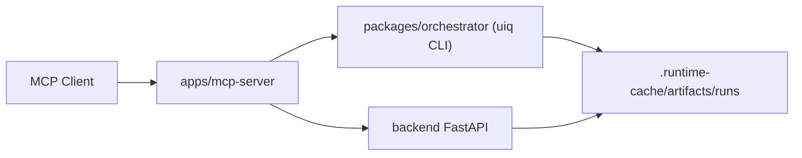

# Proofyard MCP Server

`apps/mcp-server` is the **governed MCP side road** for Proofyard.

It exposes this repository's automation, reporting, and register orchestration
flows as MCP tools for external AI clients without replacing the canonical
public mainline.

This README documents a **repo-native MCP surface** and a **later-lane package
contract**.
It is not proof that Proofyard already has a published registry package,
published Docker image, or official vendor integration.

The repo now also materializes the official MCP Registry submission descriptor
at `apps/mcp-server/server.json`, but that artifact still does **not** imply a
live registry listing.

## API vs MCP In One Sentence

- **API** = the contract layer
- **MCP** = the governed tool surface for external AI clients

If you are a builder, do not choose between them by fashion. Choose by the
shape of your integration:

- call the **API** directly when you need exact request/response control
- use **MCP** when an external AI client should consume tools instead of raw
  REST endpoints

This is also the truthful integration shape for **Codex-, Claude Code-,
OpenHands-, OpenCode-, and OpenClaw-style coding agents**:

- the coding agent remains the outer shell
- Proofyard remains the browser automation, retained evidence, and recovery
  substrate
- MCP is the governed tool bridge between them

That includes Codex-, Claude Code-, OpenHands-, OpenCode-, OpenClaw-, and
other AI-agent-shell workflows. The truthful pitch is not that this repo
replaces those shells. The truthful pitch is that it gives them a governed
browser-evidence and recovery layer.

For the direct search-intent page, see
[Proofyard for Coding Agents and Agent Ecosystems](../../docs/how-to/proofyard-for-coding-agents.md).

## When to Use It

- You want an MCP client to inspect runs, launch `uiq` workflows, or orchestrate register flows without shelling into the repo directly.
- You need a stable tool surface on top of the backend API, orchestrator CLI, and local run artifacts.
- You want a local AI agent to self-check the workspace, gather evidence bundles, and operate on recent runs.

This is also the truthful fit for Codex, Claude Code, OpenHands, OpenCode,
OpenClaw, and similar tool-using agent shells when they need:

- governed browser tools
- retained evidence and recovery surfaces
- a browser-execution layer that stays separate from the outer coding agent

Use MCP **after** you already understand the main product story:

- `just run` remains the public default road
- Task Center and Flow Workshop remain the primary local product surfaces
- MCP is the integration surface for external AI clients

As a practical rule of thumb:

- **Claude Code** and **OpenCode** are the clearest MCP-first fits because the
  outer shell already thinks in governed tools
- **Codex**, **OpenHands**, and **OpenClaw** can still use MCP, but they often
  start from API when the outer runtime wants to own orchestration directly

## Core Commands

```bash
pnpm mcp:start
pnpm mcp:check
pnpm mcp:test
pnpm test:mcp-server:real
```

## Builder Quick Path

Use this order if you are integrating Proofyard into another agent stack:

1. verify the API/generated-client contract is current

```bash
pnpm test:contract
```

That repo-native contract pass already includes generated-client freshness.

2. optionally widen the contract check if you also want the endpoint coverage gate

```bash
pnpm contracts:check-openapi-coverage
```

3. verify the MCP surface still matches the checked-in adapter contract

```bash
pnpm mcp:check
pnpm mcp:test
```

4. only then connect your MCP client to this server

That sequence keeps the contract layer and the governed tool layer honest
before you attach a higher-level agent shell.

## Architecture



## Local Prerequisites

- Install workspace dependencies with `pnpm install`.
- Start the backend if you want live API-backed MCP behavior.
- Keep the repo root available because run tools resolve `configs/profiles/`, `configs/targets/`, and `.runtime-cache/artifacts/runs/` from the workspace.

If you are deciding whether you should be here or in the API docs first:

- go to [docs/reference/universal-api.md](../../docs/reference/universal-api.md) when
  you need endpoint semantics and direct integration examples
- go to [docs/how-to/api-builder-quickstart.md](../../docs/how-to/api-builder-quickstart.md)
  when you want the shortest builder path with curl, TypeScript, and verify commands
- stay in this README when you need MCP tool-surface setup and validation

The checked-in generated client is a repo-local helper, not a published SDK.

## Install Surfaces

- **Current / usable today**:
  local checkout + `stdio` through `pnpm mcp:start`, with optional
  `UIQ_MCP_API_BASE_URL` and `UIQ_MCP_AUTOMATION_TOKEN` when the MCP process
  should talk to a live backend.
- **Publish-ready but not yet published**:
  `@proofyard/mcp-server` and
  `ghcr.io/xiaojiou176-open/proofyard-mcp-server:0.1.1`.

Registry submission artifact:

- `apps/mcp-server/server.json` is the repo-local descriptor for official MCP
  Registry submission.
- It is a submission artifact, not a listing receipt.

Use
[docs/reference/mcp-distribution-contract.md](../../docs/reference/mcp-distribution-contract.md)
for the exact current-vs-future install contract.

## MCP Docker Surface

This repo now includes a dedicated MCP container contract at
`apps/mcp-server/Dockerfile`.

That container surface is intentionally narrow:

- it builds `dist/server.cjs`
- it keeps `stdio` as the protocol
- it does not pretend to be a hosted HTTP endpoint
- it expects a mounted Proofyard checkout (or another compatible workspace
  root) through `UIQ_MCP_WORKSPACE_ROOT`

Repo verification command:

```bash
pnpm mcp:container:smoke
```

## Environment Variables

- `UIQ_MCP_API_BASE_URL`: backend base URL for live API requests.
- `UIQ_MCP_WORKSPACE_ROOT`: override the workspace root if the MCP server should point at a different checkout.
- `UIQ_MCP_DEV_RUNTIME_ROOT`: override the local MCP runtime cache root for test harnesses.
- `UIQ_MCP_TOOL_GROUPS`: optional comma-separated advanced tool groups (`advanced,register,proof,analysis` or `all`).
- `UIQ_MCP_FAKE_UIQ_BIN`: test-only override for `pnpm uiq` execution in MCP tests.
- `UIQ_ENABLE_REAL_BACKEND_TESTS`: enables `pnpm test:mcp-server:real` against a real backend instead of skipping the suite.

## Real vs Stubbed Test Boundaries

- Stubbed / contract-focused:
  - `pnpm mcp:test`
  - `pnpm mcp:smoke`
  - Uses fixtures and stub backend helpers for deterministic regression coverage.
- Real backend:
  - `pnpm test:mcp-server:real`
  - Requires `UIQ_ENABLE_REAL_BACKEND_TESTS=true` and a reachable backend runtime.
  - Validates the real `sessions -> flows -> runs` path instead of the stubbed contract layer.

## What This Surface Is Not

- not a second backend
- not a replacement for `just run`
- not a browser plugin
- not the primary first-run story
