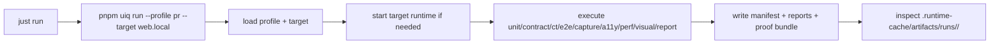

# Architecture

Proofyard is a monorepo for evidence-first browser automation.

The outward category line is:

> **Evidence-first browser automation with recovery and MCP**

The repository is intentionally organized around one public execution mainline
and one manifest-anchored evidence surface. The goal is not only to run browser
automation, but to make each run inspectable, replayable, and recoverable after
something breaks.

## System Shape

- `apps/api/`: FastAPI backend for orchestration, operator APIs, and runtime state
- `apps/web/`: operator-facing command center for launch, task review, and flow workshop
- `apps/automation-runner/`: record, extract, replay, and reconstruction workshop lane
- `apps/mcp-server/`: MCP-facing adapter for external AI clients
- `packages/orchestrator/`: canonical CLI control plane (`pnpm uiq <command>`)
- `packages/core/`: manifest, artifact, and reporting contracts

## Core Operating Model

Proofyard has three related but distinct execution concepts. Treating them as
the same thing is the easiest way to get confused.

| Lane | What it is | Primary entrypoint | Primary source of truth |
| --- | --- | --- | --- |
| Canonical evidence run | The public mainline used for standard repo-level execution and proof generation | `just run` -> `pnpm uiq run --profile pr --target web.local` | `.runtime-cache/artifacts/runs/<runId>/manifest.json` and linked reports |
| Operator run | A template-driven run inside the operator platform (`session -> flow -> template -> run`) | `/api/runs`, Web studio/workshop flows | `.runtime-cache/automation/universal/{sessions,flows,templates,runs}.json` |
| Automation task | A lower-level command execution record used by the API control plane | `/api/automation/*` | task store backend (file or SQL, depending on runtime config) |

The lanes are related, but they do not collapse into one object model.

## Canonical Public Mainline

The canonical public mainline is:

1. `just setup`
2. `just run`
3. inspect `.runtime-cache/artifacts/runs/<runId>/`

`just run` resolves to `pnpm uiq run --profile pr --target web.local`.

That canonical path is orchestrator-first and manifest-first:

- Orchestrator-first: `pnpm uiq <command>` composes profile + target and writes
  the run through one public mainline before runtime start, stage execution,
  and final exit semantics are applied.
- Manifest-first: every run writes
  `.runtime-cache/artifacts/runs/<runId>/` evidence through a
  manifest-anchored bundle so the run can be inspected, replayed, and
  discussed later.

The public proof contract expects the manifest, summary, diagnostics index, log
index, and `proof.*.json` files to exist together as one bundle.

## Operator Lane

The operator lane is the product-facing workflow that manages longer-lived
automation assets:

1. capture or import a session
2. derive a flow
3. turn the flow into a template
4. create a run from the template
5. wait for operator inputs such as OTP when needed
6. resume or replay from the resulting state

This lane is served by the FastAPI backend and the Web command center. It is
stateful even when the canonical public mainline is not running.

When an operator run needs to replay a flow, the backend materializes a
helper-compatible runtime draft under `.runtime-cache/automation/<sessionId>/`
and passes `FLOW_SESSION_ID` into the replay lane. That bridge keeps
`universal/*.json` as the operator truth surface while avoiding a hard
dependency on the global `latest-session.json` pointer for template-driven
replay.

After the first result exists, the operator lane grows through five product
surfaces:

1. **Template reuse / readiness**
   - Decide whether a flow is stable enough to become a reusable template.
2. **Compare**
   - Judge one retained evidence run against another retained run.
3. **Profile / Target Studio**
   - Tune allowlisted operator knobs under validation and rollback guardrails.
4. **AI reconstruction**
   - Rebuild or refine flows from artifacts with human review still required.
5. **Autonomy Lab Phase 1**
   - Expose artifact-driven reconstruction and orchestration actions inside
     Flow Workshop as an experimental lane.
   - Keep OTP, provider, and other manual-input gates outside the lab's
     automation scope so the safety boundary stays manual-only.
6. **MCP**
   - Expose the same repo capabilities to external AI clients through a governed
     integration surface.
7. **Review Workspace**
   - Aggregate explanation, share pack, compare context, and promotion guidance
     into one local-first handoff packet.
8. **Template Exchange**
   - Move a scrubbed template contract into another checkout through import /
     export / share, not through a marketplace.

Those surfaces sit on top of the existing lane model. They do not replace it.

Recovery also keeps an explicit Wave 5 safety boundary:

- inspection actions can be suggested immediately
- replay actions require human confirmation
- OTP, provider, and manual-input actions remain manual-only

That means Proofyard now exposes a stronger recovery assistant, but it still does not ship an autonomous self-heal loop.

## Legacy Helper Lane

`just run-legacy` and the lower-level workshop scripts still exist for deeper
record/extract/replay troubleshooting, but they are not the canonical public
mainline.

Treat helper-path outputs under `.runtime-cache/automation/` as workshop or
operator surfaces, not as the primary public proof surface.

## Advanced Side Roads

Two advanced surfaces are intentionally visible but secondary:

### AI Reconstruction

- AI reconstruction belongs to the workshop/operator side of the product.
- It starts from artifacts that already exist under the automation runtime.
- It is useful when a human wants help rebuilding a flow from HAR, HTML, video,
  or session artifacts.
- It is not part of the deterministic public mainline.

### Autonomy Lab Phase 1

- Autonomy Lab Phase 1 belongs to the experimental Flow Workshop lane, not to
  the public first-run mainline.
- It reuses existing reconstruction and orchestration capabilities as visible,
  reviewable actions instead of introducing a generic autonomy shell.
- It stays bounded by the same Wave 5 safety policy:
  - preview and draft-generation actions may be surfaced in the lab
  - OTP, provider, and other manual-input gates remain manual-only
  - no autonomous self-heal loop is introduced by this lane

### MCP

- MCP belongs to the integration side of the product.
- It allows an external AI client to inspect runs, launch workflows, or export
  proof through a governed tool surface.
- It depends on the same backend, orchestrator, and artifact truth surfaces
  described in this document.
- It is not a second backend and it must not redefine the lane model.

## Source of Truth by Concern

Different questions map to different truth surfaces:

| Question | Source of truth |
| --- | --- |
| "What happened in the canonical run?" | `.runtime-cache/artifacts/runs/<runId>/manifest.json` plus linked reports and proof files |
| "What canonical runs are still retained in this checkout?" | `/api/evidence-runs*` backed by manifest-derived evidence registry semantics |
| "What flow, template, or operator run exists right now?" | `.runtime-cache/automation/universal/*.json` |
| "What command task is queued, running, or failed?" | task store backend selected by runtime config |
| "What stages and thresholds define the canonical run?" | `configs/profiles/*.yaml` |
| "What target is being exercised and how is it started?" | `configs/targets/*.yaml` |

Do not silently substitute one truth surface for another. A canonical evidence
run, an operator run, and an automation task may describe the same user story,
but they are not interchangeable records.

## Main Local Flow

## Runtime Boundaries

- Public source code is tracked in the repository.
- Canonical run artifacts belong under `.runtime-cache/artifacts/runs/`.
- Evidence registry reads canonical runs from that same directory and must not introduce a fourth truth source.
- Retained versus missing run artifacts is a product-level state, not the same thing as docs/mainline alignment.
- Operator and helper-path state belongs under `.runtime-cache/automation/`.
- Local agent runtime directories, logs, and planning trails are not part of
  the live storefront route.

## Reading Guidance

If you are new to the repository, read in this order:

1. `README.md`
2. `docs/reference/run-evidence-example.md`
3. `packages/orchestrator/src/cli.ts`
4. `configs/profiles/pr.yaml`
5. `configs/targets/web.local.yaml`
6. `apps/api/app/services/universal_platform_service.py`
7. `apps/web/src/App.tsx`
